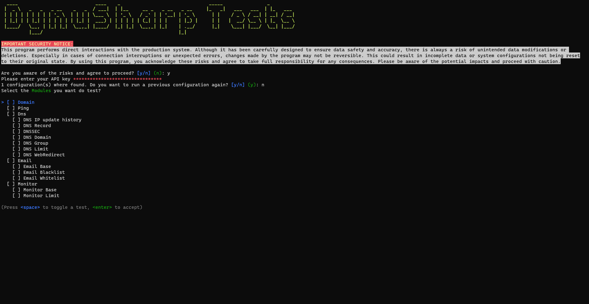

# DynuSharp.HttpTest


**'DynuSharp.HttpTest'** is a console application that serves as both a testing framework and an example implementation for the [DynuSharp library](https://github.com/CwistSilver/DynuSharp). It's designed to validate the connectivity and responsiveness of Dynu API endpoints.

## Features
- Validates Dynu API endpoints through automated tests.
- Demonstrates practical usage of the DynuSharp library.
- Supports OAuth2 and APIToken authentication methods.
- Logs test results in real-time and saves them in a JSON file for further analysis.

## Getting Started
### Using Pre-built Releases
For ease of use, pre-built releases for Windows and Linux are available under the Releases tab. Download the appropriate version for your system.

### Building from Source
If you prefer to build the application from source or if you're using a platform for which there isn't a pre-built release, follow these steps:

1. Clone the repository:
  ```bash
  git clone https://github.com/CwistSilver/DynuSharp.HttpTest.git
  ```
2. Navigate to the project directory:
  ```bash
  cd DynuSharp.HttpTest
  ```
3. Build the project using .NET CLI:
  ```bash
  dotnet build --configuration Release
  ```

## Licence
**'DynuSharp'** is licenced under the [MIT licence](LICENSE.txt).
